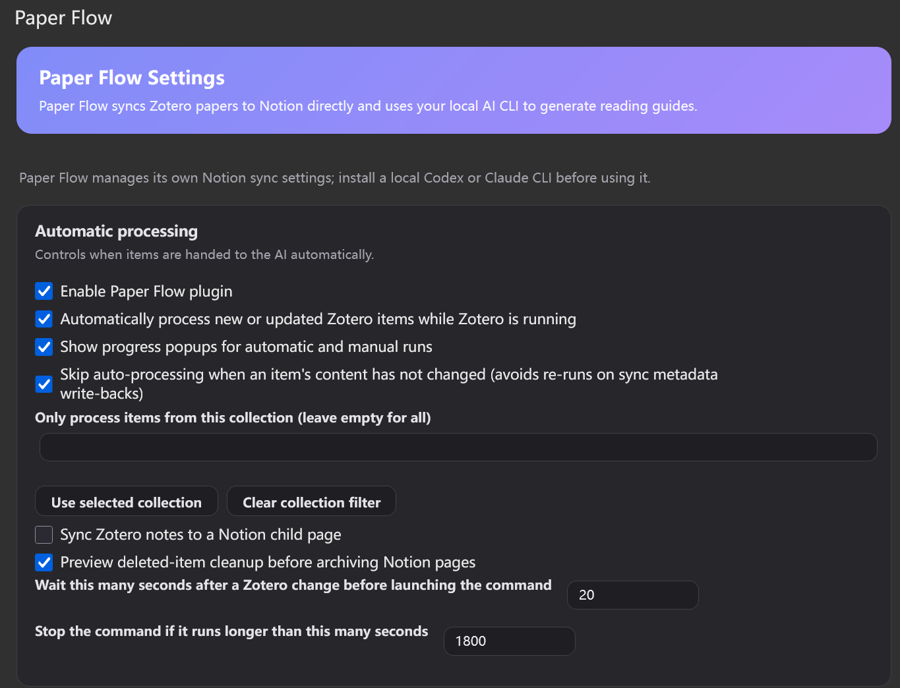

# Paper Notion Flow

**English** | [简体中文](README.zh-CN.md)

[](https://github.com/LockFaiz/paper-notion-flow/actions/workflows/ci.yml)
[](LICENSE)

Paper Notion Flow connects Zotero, Notion, and a local AI CLI into a paper-reading workflow.

It is designed as a single local workflow: Paper Flow reads Zotero, writes paper rows into Notion, and uses a local AI CLI (Codex CLI or Claude Code) to create concise reading guides — with properly rendered math (KaTeX) — under each Notion paper page.

## Quick Start

1. **Duplicate the Notion template** (all required properties pre-configured):
   👉 [Paper Collection template](https://slime-effect-c47.notion.site/24b70931354a4182801ac4c2f96840cb?v=b031fe6acbf5419aa20cbea1f77b3185) — click **Duplicate** in the top-right corner.
2. Create a [Notion integration](https://www.notion.so/my-integrations), copy its token, and connect it to your duplicated database (database page → `⋯` → Connections).
3. Install [uv](https://docs.astral.sh/uv/), then:
   ```bash
   git clone https://github.com/LockFaiz/paper-notion-flow.git
   cd paper-notion-flow
   uv sync
   ```
4. Install a local AI CLI: [Codex CLI](https://github.com/openai/codex) (`npm i -g @openai/codex`) or [Claude Code](https://docs.anthropic.com/en/docs/claude-code) — on Windows, install it **inside WSL**.
5. Download `paper-flow.xpi` from [Releases](https://github.com/LockFaiz/paper-notion-flow/releases) and install it in Zotero (Tools → Plugins → gear icon → Install Plugin From File), then restart Zotero.
6. Open **Tools → Paper Flow Settings**: fill in the workspace path (this repo folder), Notion token, database ID, pick your AI CLI, then click **Check Paper Flow setup** — all markers should read `OK`.
7. Right-click any paper in Zotero → **Paper Flow: Process selected item**. The reading guide appears under the paper's Notion page.

Full settings reference and troubleshooting: [docs/MANUAL.md](docs/MANUAL.md) ([中文手册](docs/MANUAL.zh-CN.md)).

## Screenshots



## What It Does

- Watches Zotero item events through the Paper Flow Zotero plugin.
- Processes new or updated Zotero items automatically while Zotero is running.
- Lets you manually process selected Zotero items from the right-click menu.
- Reads Zotero metadata, collections, tags, PDF attachments, abstracts, URLs, authors, dates, DOI, citation key, publication fields, notes, and item keys from the local Zotero database.
- Handles both normal metadata items and standalone PDF attachments.
- Passes local PDFs to Codex CLI or Claude Code for native PDF/file reading.
- Calls a local AI command, such as Codex CLI or Claude Code, to generate a structured reading guide.
- Writes the guide into a Notion child page under the paper entry, instead of stuffing long text into database columns.
- Writes Zotero collections into Notion topic-like properties, such as `Topic`, `Tags`, `Collections`, or `Keywords`, when those properties exist.
- Writes a `Paper Flow Notion` link attachment and `paper-flow` status tags back to Zotero after a successful sync.
- Previews deleted-item cleanup before archiving Notion pages.

## Architecture

```text
Zotero Connector / Zotero item
        |
        v
Paper Flow syncs the base metadata row into Notion
        |
        v
Paper Flow Zotero plugin watches Zotero events
        |
        v
paper-notion-flow Python CLI reads Zotero + PDF
        |
        v
Codex CLI / Claude Code / custom local AI command
        |
        v
Notion paper page gets a child reading-guide page
```

Paper Flow does not require Notero in the managed path. It creates or updates the Notion paper row itself, writes the Zotero link attachment/status tags itself, then refreshes the reading-guide child page.

## Recommended Organization

Use one Notion database for all papers.

Do not create one Notion database per research topic. That makes automation brittle. Instead:

1. Create one Notion paper database, such as `Paper Collection`.
2. Configure Paper Flow with your Notion token and database ID.
3. Create Zotero collections for topics, projects, or reading lists.
4. When saving from the Zotero browser connector, choose the target Zotero collection.
5. Paper Flow writes the Zotero collection names into the Notion topic property.

Example:

| Zotero collection | Notion paper row | Notion topic-like property |
| --- | --- | --- |
| `World_model` | One paper page in the shared database | `World_model` |
| `Robotics_RL` | One paper page in the shared database | `Robotics_RL` |
| `Diffusion_Policy` and `Imitation_Learning` | One shared paper page | Both topics, if the property is multi-select |

This gives you one searchable Notion literature library while Zotero remains the place where you decide topical membership.

## Supported Workflows

### 1. Paper Web Page With Metadata

1. Click the Zotero browser connector on a paper page.
2. Save it into the desired Zotero collection.
3. Paper Flow creates or updates the row in your Notion paper database.
4. Paper Flow sees the Zotero item or collection event.
5. Paper Flow runs the local CLI and creates a reading guide under that paper's Notion page.
6. The Zotero collection name is written into topic-like Notion properties when available.

### 2. Standalone Or Metadata-Poor PDF

1. Save or drag a local PDF into Zotero.
2. If Zotero only creates a standalone PDF item, Paper Flow can still process it.
3. Paper Flow copies the PDF into the workspace so the local AI CLI can read it through a stable path.
4. The AI guide tries to infer missing title, authors, and year from the PDF.
5. A Notion paper page and reading-guide child page are created or updated.

### 3. Direct Local PDF Import

You can also import a local PDF directly through the CLI:

```bash
uv run paper-notion-flow import --pdf-path "/path/to/your/paper.pdf"
```

## Notion Database Requirements

At minimum, the Notion database needs one title property. The recommended setup is one database template that users duplicate once, then reuse for every topic.

Recommended properties:

| Property | Type | Purpose |
| --- | --- | --- |
| `Name` or `Title` | Title | Paper row title |
| `Title` | Rich text | Optional duplicate title field |
| `Authors` or `Author` | Rich text | Author list |
| `Year` | Number | Publication year |
| `URL` or `Source URL` | URL | Paper/source URL |
| `Zotero Key` or `Item Key` | Rich text | Stable key used for updates and deletion sync |
| `Zotero URI` or `Zotero Link` | URL | Link back to the Zotero item |
| `DOI` | Rich text or URL | DOI when Zotero has one |
| `Citation Key` or `BibTeX Key` | Rich text | Better BibTeX citation key when present in Zotero Extra |
| `Date Added` and `Date Modified` | Date | Zotero local timestamps |
| `File Path` or `PDF Path` | Rich text | Local PDF path used by the CLI |
| `Publication`, `Journal`, or `Publication Title` | Rich text | Publication venue when Zotero has one |
| `Abstract` or `Abstract Note` | Rich text | Zotero abstract |
| `Item Type`, `Doc Type`, or `Type` | Select | Zotero item type or document type |
| `Topic`, `Topics`, `Tags`, `Keywords`, `Collections`, `Collection`, `Category`, or `Subject` | Multi-select or rich text | Zotero collection names are written here |
| `AI Status` or `Status` | Select or rich text | `Done` when guide generation succeeds |
| `AI Last Updated` or `Last Updated` | Date | Last guide update date |

Collection-to-topic behavior:

- If your Zotero item is inside collection `World_model`, Paper Flow writes `World_model` into the first matching Notion property from `Collections, Collection, Topic, Topics, Tags, Keywords, Category, Subject`.
- For multi-select properties, each collection becomes one option.
- If a Zotero item belongs to several collections, Paper Flow can write several topic values into the same Notion row when the property supports it.
- This means you can keep one unified Notion paper database and use Zotero collections to classify papers by topic.

Paper Flow Notion setup:

- Share your Notion paper database with your Notion integration.
- Put the Notion token and database ID into Paper Flow settings, or set `NOTION_TOKEN` and `NOTION_DATABASE_ID` in `.env` for direct CLI runs.
- Do not create a separate database target for every research topic unless you intentionally want separate libraries.

## Prerequisites

Install these before using Paper Flow:

- Zotero 7 or compatible newer Zotero versions supported by the plugin manifest.
- Zotero browser connector.
- A Notion integration token with access to your paper database.
- Python 3.11 or newer.
- uv.
- Node.js and npm, only if you want to build the Zotero plugin from source.
- A local AI CLI:
  - Codex CLI, or
  - Claude Code, or
  - another command configured with `LOCAL_AI_TEMPLATE`.

Platform notes:

- Windows users can run the CLI through WSL, which is the recommended Windows setup.
- macOS and Linux users can run the CLI through the native shell.
- Native Windows shell support exists, but WSL is usually easier for Python, uv, and local AI CLI tooling.

CLI auto-discovery:

- Paper Flow starts a non-interactive shell from Zotero, which may not inherit the same PATH as your normal terminal.
- Before running `uv`, `codex`, or `claude`, the plugin bootstraps common tool locations for WSL, macOS, Linux, and native Windows.
- Supported discovery paths include `~/.local/bin`, `~/.cargo/bin`, Homebrew, nvm, fnm, Volta, asdf, mise, Bun, npm global bins, Windows `%APPDATA%\npm`, `%LOCALAPPDATA%\Volta\bin`, nvm-windows, and Node.js install folders.
- The Python CLI does a second lookup before launching the local AI command, so managed plugin runs and direct terminal runs use the same fallback behavior.
- The setup check prints `CODEX_PATH`, `CLAUDE_PATH`, and version lines so you can see exactly which binary Paper Flow found.

## Python CLI Setup

Clone the repository:

```bash
git clone https://github.com/YOUR_NAME/YOUR_REPO.git
cd YOUR_REPO
```

Install Python dependencies:

```bash
uv sync
```

Create your environment file:

```bash
cp .env.example .env
```

Configure `.env`:

```env
NOTION_TOKEN=your_notion_integration_token
NOTION_DATABASE_ID=
AI_BACKEND=command
LOCAL_AI_COMMAND=codex
LOCAL_AI_ARGS=exec --skip-git-repo-check
LOCAL_AI_PROMPT_MODE=positional
LOCAL_AI_TEMPLATE=
OPENAI_API_KEY=
OPENAI_MODEL=gpt-5.4-mini
ZOTERO_DATA_DIR=
```

Important variables:

- `NOTION_TOKEN`: required. Create this in Notion integrations and share your database with it.
- `NOTION_DATABASE_ID`: required for direct CLI runs; the Zotero plugin can pass this from Paper Flow settings.
- `ZOTERO_DATA_DIR`: optional if Paper Flow can detect your Zotero data directory. Set it manually if detection fails.
- `LOCAL_AI_COMMAND`: usually `codex` or `claude`.
- `LOCAL_AI_ARGS`: for Codex, `exec --skip-git-repo-check`; for Claude Code, often `--print`.
- `LOCAL_AI_TEMPLATE`: advanced custom shell command with `{prompt_file}` and `{output_file}` placeholders.

Codex CLI configuration:

```env
AI_BACKEND=command
LOCAL_AI_COMMAND=codex
LOCAL_AI_ARGS=exec --skip-git-repo-check
LOCAL_AI_PROMPT_MODE=positional
```

`--skip-git-repo-check` belongs to `codex exec`, not the top-level `codex` command. Paper Flow includes it because Zotero automation can run in folders that are not Git repositories yet, and Codex otherwise refuses non-interactive execution there.

Codex CLI with explicit model and effort:

```env
AI_BACKEND=command
LOCAL_AI_COMMAND=codex
LOCAL_AI_ARGS=exec --skip-git-repo-check --model gpt-5.1 -c model_reasoning_effort="high"
LOCAL_AI_PROMPT_MODE=positional
```

Claude Code configuration:

```env
AI_BACKEND=command
LOCAL_AI_COMMAND=claude
LOCAL_AI_ARGS=--print
LOCAL_AI_PROMPT_MODE=positional
```

Claude Code's current non-interactive entry is `claude --print [prompt]`. Do not add `exec` for Claude Code unless your installed Claude CLI explicitly documents such a command.

Claude Code with explicit model and effort:

```env
AI_BACKEND=command
LOCAL_AI_COMMAND=claude
LOCAL_AI_ARGS=--print --model sonnet --effort high
LOCAL_AI_PROMPT_MODE=positional
```

AI quality controls:

- `Model`: controls which local CLI model is used. Set it when you want stable output quality across future Codex CLI or Claude Code default-model changes.
- `Effort`: controls reasoning depth when the CLI supports it. Higher effort can improve hard paper understanding but costs more time and tokens.
- `Prompt`: controls what the guide should explain. For literature reading, this is often more important than changing the model.
- `PDF access`: Paper Flow copies PDFs into the workspace before invoking the local CLI so WSL/mac paths are stable and easier for the CLI to read.
- `Extra CLI arguments`: use this for provider-specific flags that appear in newer Codex or Claude Code releases.
- `Capability summary`: the plugin shows the selected CLI's model flag, effort flag, generated local arguments, and whether the current CLI exposes model-list discovery.

Model discovery notes:

- Codex CLI and Claude Code currently expose model selection through flags such as `--model`, but they do not necessarily expose a machine-readable command that lists every model available to your account.
- Paper Flow therefore does not hard-code a fake complete model list. It reads the current CLI help, shows the supported parameter form, and keeps model names as user-editable text.
- If a future CLI release adds a real model-list command, Paper Flow's setup check is the right place to surface that capability.

Check the CLI:

```bash
uv run paper-notion-flow --help
```

Process one Zotero item:

```bash
uv run paper-notion-flow process-zotero-item --key ITEMKEY --force
```

Sync only metadata for one Zotero item without running AI:

```bash
uv run paper-notion-flow process-zotero-item --key ITEMKEY --force --skip-ai
```

Process recent Zotero changes:

```bash
uv run paper-notion-flow sync-zotero --since-hours 24
```

Limit processing to one Zotero collection:

```bash
uv run paper-notion-flow sync-zotero --collection World_model
```

Validate Notion access and recommended Paper Flow properties:

```bash
uv run paper-notion-flow check-notion
```

Preview deleted Zotero items before archiving Notion pages:

```bash
uv run paper-notion-flow prune-zotero-deletions --dry-run
```

Archive Notion pages for deleted Zotero items after review:

```bash
uv run paper-notion-flow prune-zotero-deletions
```

## Zotero Plugin Setup

Build the plugin:

```bash
cd paper-flow-zotero-plugin
npm install
npm run build
```

The XPI will be generated at:

```text
paper-flow-zotero-plugin/.scaffold/build/paper-flow.xpi
```

Install it in Zotero:

1. Open Zotero.
2. Go to `Tools -> Plugins`.
3. Click the gear icon.
4. Choose `Install Plugin From File...`.
5. Select `paper-flow.xpi`.
6. Restart Zotero.

Open `Paper Flow Settings` in Zotero and configure:

- Enable Paper Flow plugin.
- Enable automatic processing if you want Zotero events to trigger guides.
- Runtime:
  - `Auto`: Windows uses WSL; macOS/Linux use native shell.
  - `WSL`: force Windows WSL.
  - `Native shell`: force native shell.
- WSL distribution name, such as `Ubuntu`, on Windows.
- Workspace path, the path to the repository folder containing `pyproject.toml`.
- AI tool: Codex CLI, Claude Code, or custom CLI.
- If you choose Codex CLI, use command `codex` and args `exec --skip-git-repo-check`.
- If you choose Claude Code, use command `claude` and args `--print`.
- Reading-guide language: Chinese, English, Japanese, Korean, French, German, or Spanish.
- Watched collection, optional. Use the selected-collection button in the plugin settings to fill this from Zotero instead of typing collection names by hand.
- Sync Zotero notes, optional. When enabled, Zotero notes become a `Notes` child page. PDF annotations are included only after Zotero has converted them into notes.
- Deleted-item cleanup defaults to preview-first. Use the archive action only after reviewing the dry-run output.
- Custom prompt, optional. Saved in Zotero preferences.

Click `Check Paper Flow setup`. A healthy setup should show checks like:

```text
WORKSPACE:OK
UV:OK
CODEX:OK
CLAUDE:OK
PAPER_NOTION_FLOW:OK
PY_IMPORT:OK
NOTION_TOKEN:OK
NOTION_DATABASE_ID:OK
NOTION_SCHEMA:OK
NOTION_PROPERTY_DOI:DOI
NOTION_PROPERTY_CITATION_KEY:Citation Key
PYTHON_VERSION:3.12.3
UV_VERSION:uv 0.11.7
CODEX_PATH:/home/user/.nvm/versions/node/v22.22.3/bin/codex
CODEX_VERSION:codex-cli 0.134.0
CODEX_LATEST:0.136.0
CODEX_UPDATE:AVAILABLE
CODEX_UPDATE_COMMAND:npm install -g @openai/codex@latest
CODEX_NON_INTERACTIVE_ENTRY:codex exec [OPTIONS] [PROMPT]
CODEX_SKIP_GIT_REPO_CHECK_HELP:--skip-git-repo-check Allow running Codex outside a Git repository
CLAUDE_PATH:/home/user/.local/bin/claude
CLAUDE_VERSION:2.1.146 (Claude Code)
CLAUDE_LATEST:2.1.160
CLAUDE_UPDATE:AVAILABLE
CLAUDE_UPDATE_COMMAND:claude update
CLAUDE_NON_INTERACTIVE_ENTRY:claude --print [OPTIONS] [PROMPT]
CLAUDE_EXEC_COMMAND:NOT_EXPOSED_BY_CURRENT_CLI_HELP
CODEX_MODEL_FLAG:--model <MODEL>
CODEX_MODEL_DISCOVERY:UNAVAILABLE_IN_CURRENT_CLI_HELP
CODEX_EFFORT_FLAG:-c model_reasoning_effort="<level>"
CLAUDE_MODEL_FLAG:--model <model>
CLAUDE_MODEL_DISCOVERY:UNAVAILABLE_IN_CURRENT_CLI_HELP
CLAUDE_EFFORT_FLAG:--effort <level>
ZOTERO_DB:OK
```

Version notes:

- `CODEX_UPDATE:OK` or `CLAUDE_UPDATE:OK` means the detected CLI version matches the latest npm package version.
- `UPDATE:AVAILABLE` means your local CLI is older than the latest version Paper Flow can see. Run the printed update command in the same runtime used by the plugin.
- `UPDATE:UNKNOWN` usually means `npm` is missing, offline, blocked by a proxy, or the CLI was installed through a non-npm channel. In that case, Paper Flow still prints the local version.
- If you want stable output quality across CLI updates, set `AI model override` and `Reasoning/effort level` explicitly in the plugin settings.

## Reading Guide Output

The generated guide is written as Notion blocks into a child page under each paper entry.

Metadata-only sync updates the Notion database row and Zotero write-back links/tags, but does not replace the `Reading Guide` child page. The guide is only created or refreshed when AI generation runs.

Language support:

- Plugin preference UI ships with English, Simplified Chinese, Japanese, Korean, French, German, and Spanish localization.
- Reading guides can be generated in Simplified Chinese, English, Japanese, Korean, French, German, or Spanish.
- Notion guide page titles and section headings follow the selected reading-guide language.
- Custom prompts can still force any other language; if you do that, also mention the target language explicitly in the prompt.

Default sections include:

- One-sentence overview
- Problem
- Related-work landscape
- Core mechanism
- Contributions and strengths
- Key figures and tables
- Experiments and data-backed conclusions
- Conclusions
- Limitations and concerns

The guide is intentionally not a full-text translation. The default Chinese prompt asks for concise plain-language explanation that can be read in under 10 minutes.

## Figure And Table Support

Current support:

- Paper Flow can ask the AI to explain figures and tables when useful captions or table text are visible in the extracted PDF text.

Not currently supported:

- Cropping figure images out of PDFs.
- Uploading images to Notion.
- Embedding original PDF figures into the guide page.

This requires a separate PDF figure/table extraction and Notion file-upload or external-hosting pipeline.

## Prompt Customization

The plugin settings page includes a custom prompt box.

- Leave it empty to use the built-in default prompt.
- Fill it with your own instructions to override the built-in reading-guide instructions.
- The custom prompt is stored in Zotero preferences and should survive plugin upgrades.
- Use `Fill default prompt` if you want to start from the built-in prompt and edit it.

## Development

Python checks:

```bash
uv run python -m compileall src
```

Plugin checks:

```bash
cd paper-flow-zotero-plugin
npm run lint:check
npm run build
```

## Repository Hygiene

Do not commit:

- `.env`
- `.venv/`
- `data/`
- `src/*.egg-info/`
- `paper-flow-zotero-plugin/node_modules/`
- `paper-flow-zotero-plugin/.scaffold/`
- built `.xpi` files unless you intentionally publish them as release assets

## Limitations

- Paper Flow reads the local Zotero SQLite database; Zotero data path detection may need manual configuration.
- PDF understanding depends on the selected local CLI's native file/PDF-reading capability.
- Local AI CLI behavior depends on your Codex CLI, Claude Code, or custom command installation.
- Image embedding is not implemented yet.

## Acknowledgments

- [Notero](https://github.com/dvanoni/notero) by David Vanoni pioneered the Zotero → Notion sync workflow that inspired this project. Paper Flow shares Notion property naming conventions with it for compatibility, but contains no Notero code.
- The Zotero plugin is built on [zotero-plugin-template](https://github.com/windingwind/zotero-plugin-template), [zotero-plugin-toolkit](https://github.com/windingwind/zotero-plugin-toolkit), and [zotero-plugin-scaffold](https://github.com/northword/zotero-plugin-scaffold) by windingwind and the Zotero plugin community, with `bootstrap.js` derived from Zotero's official [Make It Red](https://github.com/zotero/make-it-red) example.
- Reading guides are generated by your locally installed [Codex CLI](https://github.com/openai/codex) or [Claude Code](https://docs.anthropic.com/en/docs/claude-code).

## License

AGPL-3.0-or-later.
